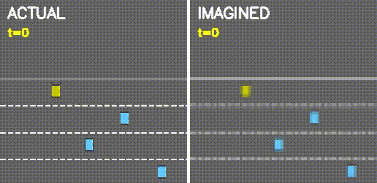
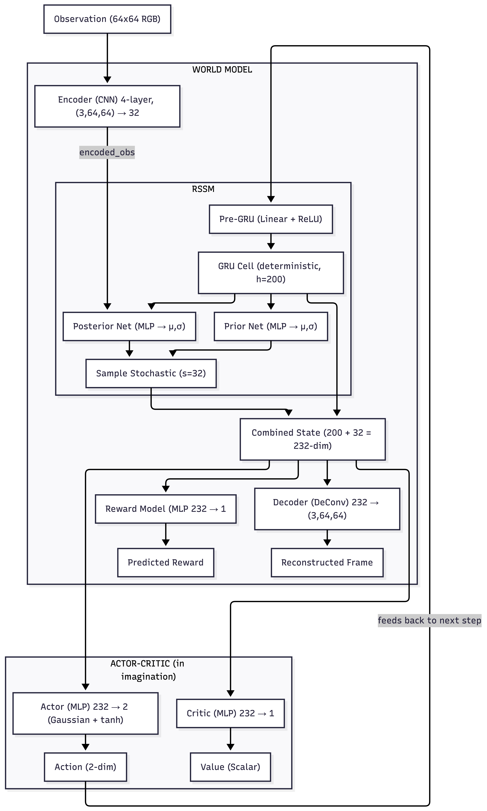

# Dream the Road: Tiny Dreamer for Highway-env 🚗

> A Dreamer V1 world model implemented from scratch in PyTorch, applied to autonomous highway driving.

**Course:** CSC 580 Artificial Intelligence II, Winter 2026, DePaul University

**Author:** Amarsaikhan Batjargal

---




---

## Overview

This project implements the [Dreamer V1](https://arxiv.org/abs/1912.01603) algorithm from scratch and applies it to the [highway-v0](https://highway-env.farama.org/environments/highway/) environment. The agent learns a world model that can "dream" about driving, then trains a policy entirely in imagination without additional real-world interaction.

**Key results:**
- **8.3x improvement** over random policy (119.76 vs 14.42 mean reward)
- **Best episode:** 158.89 reward
- **100% survival rate** across evaluation episodes (all 200 steps completed)
- World model learns to reconstruct highway scenes and predict rewards with 99.5% loss reduction

### How It Works

#### Learnt Models and Components

The following neural network models are learned in Dreamer V1:

| Notation | Name | Description |
|----------|------|-------------|
| $p_\theta(s_t \mid s_{t-1}, a_{t-1}, o_t)$ | **Representation model** | Encodes observation into posterior latent state (Encoder + RSSM posterior) |
| $q_\theta(s_t \mid s_{t-1}, a_{t-1})$ | **Transition model** | Predicts next latent state without observation (RSSM prior) |
| $q_\theta(r_t \mid s_t)$ | **Reward model** | Predicts scalar reward from latent state (MLP) |
| $q_\phi(a_t \mid s_t)$ | **Action model** | Selects continuous actions from latent state (Actor MLP) |
| $v_\psi(s_t)$ | **Value model** | Estimates expected return from latent state (Critic MLP) |

## Architecture




The system consists of six neural networks with a total of **3,087,841 parameters**:

| Component | Type | Input / Output | Role |
|-----------|------|---------------|------|
| **Encoder** | 4-layer CNN | (3, 64, 64) to 32-dim | Compress frames to latent space |
| **RSSM** | GRU + MLPs | state + action to next state | Learn temporal dynamics (deterministic + stochastic) |
| **Reward Model** | 3-layer MLP | 232-dim to scalar | Predict rewards from latent states |
| **Decoder** | 4-layer Transposed CNN | 232-dim to (3, 64, 64) | Reconstruct frames (ensures latent captures visual info) |
| **Actor** | 2-layer MLP | 232-dim to 2-dim Gaussian | Select continuous actions (steering + acceleration) |
| **Critic** | 2-layer MLP | 232-dim to scalar | Estimate expected returns for value-based learning |

The RSSM maintains a 200-dimensional deterministic state (GRU hidden) and a 32-dimensional stochastic state (Gaussian latent), giving a combined 232-dimensional state representation.


```
Real Experience -> Replay Buffer -> Train World Model (supervised)
                                            │
                                            ▼
                                    Imagined Rollouts -> Train Actor-Critic (RL)
                                            │
                                            ▼
                                    Improved Policy -> Collect More Experience
```

1. The agent collects real driving episodes and stores them
2. The world model (encoder + RSSM + decoder + reward model) learns environment dynamics from stored data
3. The actor-critic trains by "dreaming" trajectories inside the learned world model
4. The improved policy collects better data, and the cycle repeats

## Project Structure

```
dream-the-road/
├── README.md                          # This file
├── dream_theroad_tiny_dreamer.ipynb   # Main notebook (full implementation, training, and evaluation)
├── requirements.txt                   # Python dependencies
├── models.py                          # All 
├── figures/
│   ├── architecture.png               # Architecture diagram
│   ├── sample_frame.png               # Raw vs preprocessed environment frame
│   ├── training_curves.png            # All 6 training loss/reward curves
│   ├── nstep_prediction.png           # Actual vs imagined frames (30-step horizon)
│   ├── reward_prediction.png          # Actual vs predicted rewards per step
│   └── evaluation_results.png         # Policy comparison + per-episode rewards
├── videos/
│   ├── dreamer_comparison.mp4         # Side-by-side: actual vs world model predictions
│   ├── pure_imagination  .mp4         # The world model dreams a trajectory from a single frame
│   └── agent_driving.mp4              # Trained agent driving in the real environment
└── checkpoints/
    └── dreamer_highway_checkpoint.pt  # Saved model weights, and training metrics
```

## Results

### Training

| Metric | Start | End | Change |
|--------|-------|-----|--------|
| World Model Loss | 1.61 | 0.055 | -96.6% |
| Reconstruction Loss | 0.022 | 0.002 | -90.9% |
| KL Divergence | 0.014 | 0.459 | Activated stochastic path |
| Reward Prediction Loss | 0.795 | 0.004 | -99.5% |
| Episode Reward | 15.64 | 92-148 | +8.3x over random |

### Evaluation

| Metric | Value |
|--------|-------|
| Random policy reward | 14.42 +/- 4.36 |
| Dreamer policy reward | 119.76 +/- 39.65 |
| Best episode | 158.89 |
| Episode survival | 200/200 steps (100%) |


## Live Demo

Try the trained model interactively on Hugging Face Spaces:

**[https://huggingface.co/spaces/amarsaikhan/dreamer-highway-v0](https://huggingface.co/spaces/amarsaikhan/dreamer-highway-v0)**

Three modes available:
- **Actual vs Imagined** - Side-by-side comparison of real environment vs world model predictions
- **Pure Imagination** - The model dreams a driving trajectory from a single frame
- **Agent Driving** - Watch the trained agent drive in the simulation

## Quick Start

### Requirements

```
Python 3.8+
PyTorch 1.12+
gymnasium
highway-env
matplotlib
imageio
numpy
opencv-python
```

### Run on Google Colab (Recommended)

1. Open `dream_theroad_tiny_dreamer.ipynb` in Google Colab
2. Set runtime to **GPU** (T4 recommended)
3. Run all cells sequentially
4. Training takes approximately 30-40 minutes on a T4 GPU

### Run Locally

```bash
git clone https://github.com/amarsaikhanb/dreamer-world-model-highway.git
cd dreamer-world-model-highway
pip install -r requirements.txt
jupyter notebook dream_theroad_tiny_dreamer.ipynb
```

## Key Design Decisions

**FREE_NATS = 0.0:** The standard Dreamer V1 uses free nats of 3.0 to prevent posterior collapse, but in this environment that threshold was too high and completely blocked the stochastic latent from being used. Setting it to zero allows the KL divergence to train freely from the start.

**KL_WEIGHT = 0.1:** Reduced from the default 1.0 so that reconstruction and reward losses dominate the gradient signal. This lets the world model prioritize accurate frame and reward prediction over matching the prior.

**Reward loss weight = 2.0:** The reward model was underfitting in early experiments, so its loss contribution was doubled.

**Separate actor/critic rollouts:** The critic trains on a fully detached imagination rollout (no gradients through the world model), while the actor gets a separate rollout with full gradient flow through the differentiable RSSM and reward model. This is the true Dreamer V1 approach and was critical for stable training.

**Target-scale normalization:** The actor loss is divided by the magnitude of the lambda-return targets to keep gradients bounded as the critic improves and return estimates grow.

## License

This project was completed as a course assignment for CSC 580 at DePaul University. Feel free to use it as a reference for learning about world models and Dreamer.
